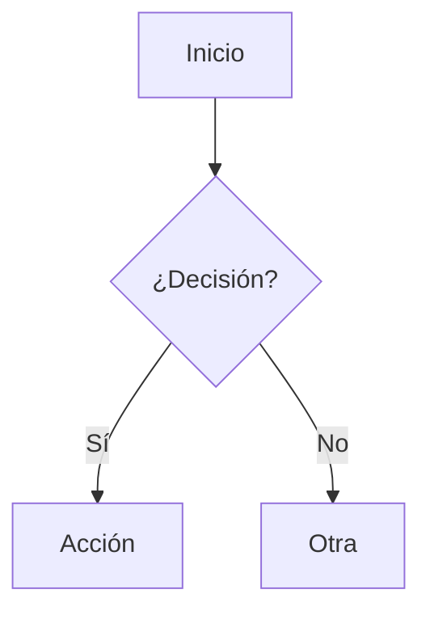

# Markdown Mermaid

Aplicación de **escritorio para Windows** (Electron + Vue 3) para abrir, editar y visualizar documentos **Markdown** con soporte nativo para diagramas **Mermaid** y **lector TTS**. Haz **doble clic** sobre un `.md` en el explorador y edita/renderiza el documento con modos **Vista** (por defecto), **Split** y **Editor**, con guardado directo, exportación a **Word (.docx)** y lectura en voz alta.

## Características

- 📂 **Abre archivos `.md` / `.markdown` / `.mdx`** con doble clic en el explorador (asociación registrada por el instalador).
- 🪟 **Multi-ventana**: cada archivo se abre en una ventana distinta (estado/watcher/TTS aislado por ventana).
- 🖥️ Modos de vista: **Editor**, **Split** y **Vista previa**, con actualización en tiempo real.
- 💾 **Guardado directo** (Ctrl+S), **Guardar como** (Ctrl+Shift+S), **Abrir** (Ctrl+O) y **Nuevo** (Ctrl+N). Botón Guardar habilitado por tracking `savedContent` + evento dirty inmediato.
- 🔊 **Lector TTS Windows**: motor Web Speech (SAPI5) + fallback PowerShell `System.Speech`; barra Lectura con `▶ Leer/⏸ Pausar/▶ Reanudar/⏹ Detener`, selector de voz (es-ES/MX), velocidad 0.5-2x, motor `Web/Windows SAPI`, atajo `Ctrl+Shift+L`, lectura de selección o documento completo. Solo streaming en memoria.
- 🧩 Markdown completo: tablas, listas, citas, links automáticos (markdown-it).
- 🎨 Resaltado de sintaxis en bloques de código (highlight.js).
- 📊 Diagramas **Mermaid v11** renderizados a SVG (flowchart, sequence, class, gantt, pie…).
- 💾 Descarga de cada diagrama como **SVG** o **PNG** (2x).
- 📄 Descarga del **documento completo como Word (.docx)**, con los diagramas Mermaid como imágenes.
- 🔔 Indicador de **cambios sin guardar** y confirmación al cerrar.
- 🔄 Detecta cambios **externos** en el archivo abierto (con recarga opcional).
- 🔒 Seguro: proceso de render aislado, CSP, HTML saneado con DOMPurify y Mermaid en `securityLevel: 'strict'`.
- 🌗 Tema claro/oscuro automático según el sistema.

## Requisitos

- Node.js ≥ 20.19 (el proyecto fue desarrollado con Node 24)
- npm
- Windows x64 (target de empaquetado)
- Voces SAPI instaladas para TTS

## Instalación

```bash
npm install
```

> **Nota (Windows/npm)**: si npm bloquea los scripts postinstall de `electron`/`esbuild`/`sharp`, aprobarlos con `npm install-scripts approve electron esbuild sharp` y, si falta el binario de Electron, regenerarlo con `node node_modules/electron/install.js`.

## Uso

```bash
npm run dev        # Desarrollo con HMR (abre la app de escritorio)
npm run build      # Compila main + preload + renderer a out/
npm run start      # Previsualizar el build de producción
npm run build:win  # Compila y genera el instalador NSIS en dist/
npm run icon       # Regenera build/icon.ico y build/icon.png
```

### Flujo de trabajo

1. Abre la app: se carga un **documento de ejemplo** con varios tipos de diagramas, en **modo Vista**.
2. Escribe en el editor (izquierda) o pega tu contenido; la vista previa se actualiza sola.
3. Para abrir otro archivo: **Ctrl+O**, botón **Abrir**, arrastra un `.md` sobre el editor, o haz **doble clic** en el explorador (abre nueva ventana).
4. Usa el toggle **Editor / Split / Vista** para cambiar el layout.
5. Guarda con **Ctrl+S** (o **Guardar como** si aún no tiene nombre). El botón se habilita al primer keystroke.
6. Pasa el ratón sobre un diagrama y usa los botones **SVG** / **PNG** para descargarlo.
7. Usa **Descargar Word** para generar un `.docx` con el documento completo (incluidos los diagramas).
8. Para escucha: selecciona texto (opcional) y pulsa **▶ Leer** en la barra Lectura o `Ctrl+Shift+L`; controla **Pausar/Reanudar/Detener**, elige voz y velocidad, y cambia de motor `Web/Windows SAPI` según prefieras.

> La **asociación de archivos** (doble clic) se activa al **instalar** la app. Para probarla en desarrollo, lanza la app con la ruta como argumento: `npm run dev -- ruta\documento.md`.

### Sintaxis de diagramas

Los diagramas se escriben en bloques de código con el lenguaje `mermaid`:

````markdown

````

### Ejemplos de tipos soportados

| Tipo            | Sintaxis inicial     |
| --------------- | -------------------- |
| Flowchart       | `flowchart TD`       |
| Secuencia       | `sequenceDiagram`    |
| Clases          | `classDiagram`       |
| Gantt           | `gantt`              |
| Pie             | `pie`                |
| Estado          | `stateDiagram-v2`    |
| ER              | `erDiagram`          |
| Timeline        | `timeline`           |

Consulta la [documentación de Mermaid](https://mermaid.js.org/) para la sintaxis completa.

## Instalación del instalador

El artefacto `dist\Markdown Mermaid Setup 0.2.0.exe` es un instalador NSIS (modo asistido, **por equipo**). Durante la instalación registra la asociación de `.md`, `.markdown` y `.mdx` para que el doble clic abra la aplicación (cada archivo en ventana nueva).

## Estructura del proyecto

```
src/
├── main/index.js                # Proceso principal (multi-ventana, IPC, fs, watcher, TTS SAPI, descargas)
├── preload/index.js             # contextBridge + webUtils + TTS IPC (window.electronAPI)
└── renderer/                    # App Vue
    ├── index.html               # CSP
    └── src/
        ├── main.js              # Punto de entrada
        ├── App.vue              # Toolbar, layout, estado del documento y barra TTS
        ├── style.css            # Tema y estilos
        ├── components/
        │   ├── MarkdownViewer.vue   # Vista previa
        │   └── MarkdownInput.vue    # Editor + drag & drop + evento dirty
        └── lib/
            ├── markdown.js          # markdown-it + DOMPurify + fence mermaid
            ├── mermaidRenderer.js   # Render de diagramas + toolbar de descarga
            ├── diagramDownload.js   # Export SVG/PNG + rasterizado a Blob
            ├── markdownToDocx.js    # Generación del documento Word (.docx)
            ├── tts.js               # TTS Web Speech + stripMarkdown + chunking SAPI
            └── examples.js          # Documento de ejemplo
```

## Documentación

Más detalle en `docs/`:

- [Plan de implementación](plan-implementacion.md)
- [Contexto del proyecto](contexto.md)
- [Cronología de desarrollo](cronologia.md)
- [Arquitectura](arquitectura.md)
- [Guía de Release](guia-release.md) — del repositorio al instalador en GitHub

## Limitaciones conocidas

- La asociación de archivos solo se registra con el **instalador**, no en desarrollo.
- Cada archivo abre una ventana nueva (multi-ventana); cerrar todas cierra la app (excepto macOS).
- Los diagramas siempre usan **tema claro** (independiente del tema de la app).
- El bundle de producción incluye un chunk grande de mermaid (~3.7 MB) más `docx`; los tipos de diagrama se cargan como chunks lazy.
- Las imágenes inline de Markdown (``) se exportan a Word como su texto alternativo.
- No hay resaltado de sintaxis en el editor (texto plano).
- No hay persistencia del documento entre sesiones ni pestañas.
- TTS es solo streaming en memoria (no genera wav/mp3); requiere voces SAPI instaladas en Windows.

## Licencia

Privado / sin licencia especificada.
